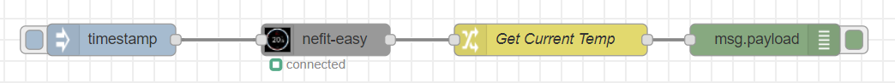

# Nefit Easy™ Node-RED Node

<span class="badge-npmversion"><a href="https://www.npmjs.com/package/node-red-contrib-nefit-easy2" title="View this project on NPM"></a></span>
<span class="badge-npmdownloads"><a href="https://npmjs.org/package/node-red-contrib-nefit-easy2" title="View this project on NPM"></a></span>
[](https://travis-ci.com/RaimondB/node-red-contrib-nefit-easy)
[](https://snyk.io/test/github/RaimondB/node-red-contrib-nefit-easy?targetFile=package.json)
[](https://github.com/semantic-release/semantic-release)

A simple setup to get the current temperature is shown below:


Also see [a number of importable examples in my repository](https://github.com/RaimondB/node-red-contrib-nefit-easy/tree/master/examples)).

---
*Pro-Tip* : Be sure to use an external trigger (such as the inject node) to get the latest status. This way you can determine the update speed yourself. However, keep in mind that updating quicker than every 60 seconds will probably result into errors because of limitations of the Nefit API.

---

This Node-RED Node is based on the <a href="https://github.com/robertklep/nefit-easy-commands">Nefit Easy™ commands library build by Robert Klep</a>.
At this link also all usable commands are documented and not repeated here for maintainability.

*Minimum supported Node version is now at 10.x.*

## Features

* Get Status (all information that is visible in the App, including current Temp.)
* Get Pressure
* Get Location (as set up in App)
* Get Program data (active program, progam1 and program2
* Get Display boiler statuscode
* Get Actual Supply temperature
* Set temperature
* Set Fireplace Mode (enable or disable)
* Get User Mode (manual or clock operation mode
* Set User Mode
* Get Gas Usage Data per day

## Installation

```shell
npm -g i node-red-contrib-nefit-easy2
```
